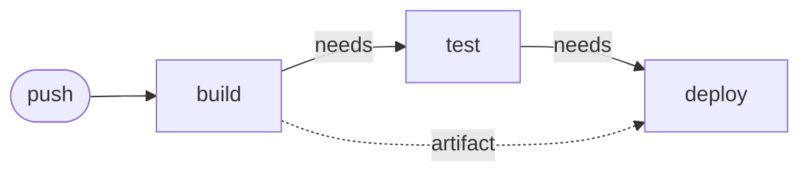

# pipeline-demo


Pipeline d'intégration et de déploiement continus construit avec **GitHub Actions**, sur une application Python minimale.

> **Projet d'apprentissage.** L'application est volontairement triviale : l'objet de ce dépôt n'est pas le code, mais la **chaîne CI/CD** qui l'entoure, et surtout ce qu'on apprend en la cassant.

---

## Objectif

Comprendre en pratique les mécanismes d'une chaîne CI/CD :

- l'enchaînement conditionnel des jobs,
- le transport d'un livrable d'une étape à l'autre,
- l'injection de secrets à l'exécution,
- et la **lecture des logs quand ça échoue** : la compétence réellement utile au quotidien.

---

## Architecture



Trois jobs chaînés par `needs`. Le trait plein est la dépendance d'exécution, le pointillé le transport de l'artifact.

| Job | Rôle | Points notables |
|---|---|---|
| **`build`** | Installe Python et les dépendances, prépare le livrable dans `dist/` et le publie comme artifact | Produit un livrable unique, réutilisé plus loin |
| **`test`** | Rejoue l'installation et lance la suite `pytest` | Bloque toute la suite en cas d'échec |
| **`deploy`** | Récupère l'artifact, vérifie la présence du secret, simule la mise en service | **Pas de `checkout`** : il n'a pas besoin des sources, seulement du livrable |

### Détails d'implémentation

**Le chaînage.** Sans `needs`, les trois jobs partiraient en parallèle. C'est `needs` qui garantit qu'un test en échec empêche le déploiement : la barrière est là, pas ailleurs. *(Équivalent des `stages` sous GitLab CI.)*

**L'artifact.** `build` construit une fois et publie ; `deploy` télécharge. On ne reconstruit jamais le livrable entre deux étapes : c'est ce qui garantit que ce qui est testé est bien ce qui est déployé.

**Le secret.** `API_TOKEN` est injecté depuis les *repository secrets*, jamais versionné. Une fois enregistré, il n'est plus lisible : seulement remplaçable.

**La vérification explicite.** Le job `deploy` teste la présence du jeton avant de continuer :

```bash
if [ -z "$API_TOKEN" ]; then
  echo "ERREUR : secret absent"
  exit 1
fi
```

Sans ce garde-fou, un secret manquant ne produirait **aucune erreur** : la variable serait simplement vide et le déploiement passerait au vert. Voir le journal ci-dessous.

---

## Journal des pannes

Le cœur du projet. Chaque panne a été soit rencontrée, soit provoquée volontairement, puis diagnostiquée à partir des seuls logs.

| # | Symptôme | Cause | Leçon |
|---|---|---|---|
| 1 | Le workflow ne démarre pas : *Invalid workflow file* | `-uses:` au lieu de `- uses:` : en YAML, le tiret d'un élément de liste exige un espace | Une erreur de syntaxe n'échoue pas le build, elle **empêche le pipeline d'exister** |
| 2 | *Implicit keys need to be on a single line* | `run:` suivi d'un script multi-lignes sans le block scalar `\|` | Une commande sur une ligne → `run: cmd`. Plusieurs lignes → `run: \|` puis le script indenté |
| 3 | `cp: cannot stat 'app.py': No such file or directory` dans `build` | Le fichier applicatif n'existait pas sous le nom attendu par le workflow | Le runner ne voit que **ce qui est réellement versionné**. Vérifier le dépôt, pas l'éditeur local |
| 4 | `ModuleNotFoundError: No module named 'App'` dans `test` | Casse incohérente entre le nom du fichier, l'import et le workflow | **Linux distingue `App.py` de `app.py`, Windows non.** Un projet valide en local peut échouer sur le runner pour une seule majuscule |
| 5 | `deploy` non exécuté, marqué *skipped* | `needs: test` sur un job en échec | Comportement attendu, pas un bug : **le livrable cassé n'a jamais atteint le déploiement** |

**Ce que ces pannes ont en commun.** Les deux premières empêchent le pipeline de s'exécuter ; les deux suivantes le font échouer pendant l'exécution. La distinction compte au diagnostic : une erreur de syntaxe se voit avant tout démarrage, une erreur d'exécution se lit dans les logs du job concerné.

*(Restent à provoquer volontairement : version d'outil inexistante, test en échec, secret manquant.)*

---

## Correspondance avec les autres outils

Les concepts sont transférables ; seule la syntaxe change.

| Concept | GitHub Actions | GitLab CI | Jenkins |
|---|---|---|---|
| Fichier de définition | `.github/workflows/*.yml` | `.gitlab-ci.yml` | `Jenkinsfile` |
| Phase | *(via `needs`)* | `stage` | `stage` |
| Tâche | `job` | `job` | `step` |
| Machine d'exécution | runner | runner | agent / node |
| Livrable transmis | `upload-artifact` | `artifacts:` | `archiveArtifacts` |
| Secret | `secrets.X` | variable masquée | credentials |

---

## Structure

```
.
├── .github/workflows/ci.yml   # définition du pipeline
├── app.py                     # application
├── test_app.py                # tests unitaires
├── requirements.txt           # dépendances
└── README.md
```

**Convention de nommage :** tout en minuscules. Voir les pannes 3 et 4.

## Reproduire en local

```bash
git clone https://github.com/juniorabakar/pipeline-demo.git
cd pipeline-demo
pip install -r requirements.txt
pytest -v
```

Pour que le job `deploy` aboutisse, créer un secret `API_TOKEN` dans
**Settings → Secrets and variables → Actions**.

---

*Stack : GitHub Actions · Python 3.11 · pytest*
